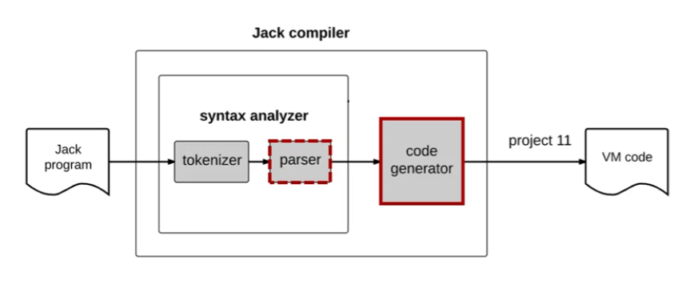

Jack Compiler
---
Homework for module 7.

Compiles `.jack` programs to executable `.vm` files. Bases on SyntaxAnalyser from previous module.

To use pass the file path or directory path as a program argument.
